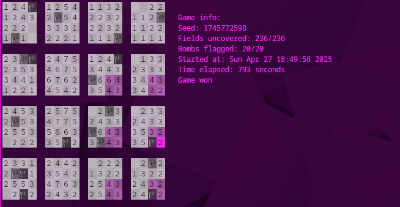

# 4d minesweeper

4d minesweeper made for the terminal


## How to play

You have to find all the mines in a 4 dimensional field. The pink cursor highlights the current field you're on and its value shows the number of bombs that are around it. To help you find which fields are in the area of influence of the current field, they are highlighted in a less saturated shade of pink. Have fun finding all the mines!



### Controls

<pre>
  Move right in x:     right arrow, l
  Move left in x:      left arrow, h
  Move up in y:        up arrow, k
  Move down in y:      down arrow, j
  Move right in z:     d, ctrl-l
  Move left in z:      a, ctrl-h
  Move up in q:        w, ctrl-k
  Move down in y:      s, ctrl-j
  Mark bomb:           m
  Uncover field:       space
  Find empty field:    f
  Turn on delta mode:  u
  Pause game:          p
  Open options:        o
  Start new game:      n
  Print controls:      c
  Toggle info:         i
  Quit game:           q
</pre>

> [!WARNING]
> Currently delta mode is not implemented

## Compiling and running

To compile the program, simply run:

```
gcc main.c mtwister.c -lm -o 4dminsweeper
```

> [!WARNING]
> This program was made for Linux, i doubt that it would work on windows

To run the program, simply type:

```
./4dminesweeper
```

> [!WARNING]
> Make sure your terminal is big enough!!!

> [!TIP]
> When running the program in debug mode, make sure to send the error messages somewhere else by appending `2> [file or terminal]` to the command e.g.: `./4dminesweeper -g 2> /dev/pts/2`

There are a few extra options you could add, if you don't want to edit the settings while the game is running

<pre>
  -h, -?, --help         Show this menu
  -d, --do_random        If true, sets the seed to the current time
  -s, --seed             Input seed as unsigned integer
  -b, --bombs            Input amount of bombs as unsigned integer
  -r, --recursion_depth  The amount of recursion allowed when uncovering fields
  -a, --area, --size     Size of the game (must be given as a comma separated list of unsigned integers e.g.: 4, 4, 4, 4)
  -i, --show_info        Show info about the current game. Can be set to true or false
  -g, --debug            Run in debug mode. Allows editing of field contents
</pre>

## Missing features

- [ ] Delta mode: decrement surrounding numbers when bomb is marked
- [x] Big numbers: currently i don't know what will happen if a field has a 3 digit number
- [ ] Fix timer: currently the timer only updates when you move, idk how to fix it

## TODO

- [x] Add keyboard shortcut for toggling info
- [ ] Make keyboard shortcuts customisable
- [ ] Add config file
- [ ] Write installer
- [ ] Add scrolling to the 4d field
- [ ] Make info display on top of the game
- [ ] Assume field size of 1 when user gives less than 4 integers for option --size
- [ ] Make field shrink after numbers change

## Special thanks

To GNU for their licence and the code for setting the terminal to noncanonical mode
[Noncanonical Mode Example](https://www.gnu.org/software/libc/manual/html_node/Noncanon-Example.html)

To [EsultaniK](https://github.com/ESultanik) and [Wallabra](https://github.com/wallabra) for writing the code for the Mersenne twister
[Mtwister](https://github.com/ESultanik/mtwister)

To Julian Schlüntz for creating 4D Minesweeper on steam, the original inspiration for this project
[4D Minesweeper](https://store.steampowered.com/app/787980/4D_Minesweeper/)
