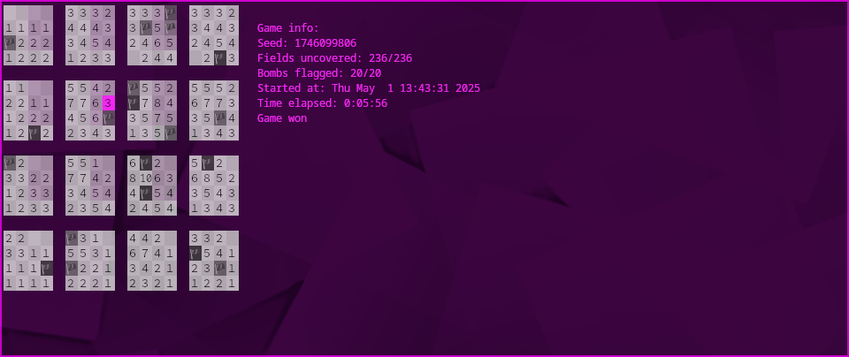

# 4d minesweeper

4d minesweeper made for the terminal

https://github.com/user-attachments/assets/e213d4ac-162e-486d-b00c-a47d5d4c2fa0

## How to play

You have to find all the mines in a 4 dimensional field. The pink cursor highlights the current field you're on and its value shows the number of bombs that are around it. To help you find which fields are in the area of influence of the current field, they are highlighted in a less saturated shade of pink. Have fun finding all the mines!



### Controls

<pre>
  Move right in x:       right arrow, l
  Move left in x:        left arrow, h
  Move up in y:          up arrow, k
  Move down in y:        down arrow, j
  Move right in z:       d, ctrl-l
  Move left in z:        a, ctrl-h
  Move up in q:          w, ctrl-k
  Move down in y:        s, ctrl-j
  Mark bomb:             m, e
  Mark bomb chording:    M, E
  Uncover field:         space
  Find empty field:      f
  Turn on delta mode:    u
  Give up/reveal field:  g
  Pause game:            p
  Open options:          o
  Start new game:        n
  Print controls:        c
  Toggle info:           i
  Quit game:             q
</pre>

## Compiling and running

To compile the program, simply run:

```
gcc main.c mtwister.c -lm -o 4dminsweeper
```

> [!WARNING]
> This program was made for Linux, i doubt that it would work on windows

> [!WARNING]
> This program was only tested on Arch Linux!
> According to this [issue](https://stackoverflow.com/questions/1662909/undefined-reference-to-pthread-create-in-linux), you have to add `-pthread` on Ubuntu systems e.g.: `gcc main.c mtwister.c -lm -pthread -o 4dminsweeper
`

To run the program, simply type:

```
./4dminesweeper
```

> [!WARNING]
> Make sure your terminal is big enough!!!

There are a few extra options you could add, if you don't want to edit the settings while the game is running

<pre>
  -h, -?, --help         Show this menu
  -d, --do_random        If true, sets the seed to the current time
  -s, --seed             Input seed as unsigned integer
  -b, --bombs            Input amount of bombs as unsigned integer
  -r, --recursion_depth  The amount of recursion allowed when uncovering fields
  -a, --area, --size     Size of the game (must be given as a comma separated list of unsigned integers e.g.: 4, 4, 4, 4)
  -i, --show_info        Show info about the current game. Can be set to true or false
  -u, --show_delta       Field numbers only show unmarked bombs instead of total. Can be set to true or false
  -g, --debug            Run in debug mode. Allows editing of field contents
</pre>

> [!TIP]
> When running the program in debug mode, make sure to send the error messages somewhere else by appending `2> [file descriptor]` to the command e.g.: `./4dminesweeper -g 2> error.txt`
> [!TIP]
> To send the error messages to a different terminal, go to said terminal and type `tty`. This will return something like `/dev/pts/[number]` (e.g.: `/dev/pts/2`). Now you have the _file descriptor_ of that terminal. Now you can use `2>` to send everything that is printed to standard error, to whatever you put after it (e.g.: the _file descriptor_ of a terminal). (For your information: I still consider myself a Linux noob. I am pretty sure all the information I have provided is correct. Please do your own research! A good place to start is the [Arch wiki](https://wiki.archlinux.org) or any of the many Linux forums)

## Missing features

- [x] Delta mode: decrement surrounding numbers when bomb is marked
- [x] Big numbers: currently i don't know what will happen if a field has a 3 digit number
- [ ] Fix timer: currently the timer only updates when you move, idk how to fix it

## TODO

- [x] Add keyboard shortcut for toggling info
- [ ] Make keyboard shortcuts customisable
- [ ] Add config file
- [ ] Write installer
- [ ] Add scrolling to the 4d field
- [ ] Make info display on top of the game
- [ ] Assume field size of 1 when user gives less than 4 integers for option --size
- [x] Make field shrink after numbers change
- [ ] Graphical bug in cursor's area of influence when unpausing
- [ ] Graphical bug with timer, prints to random x position sometimes
- [ ] Graphical bug with timer, only prints partially
- [ ] Graphical bug with flags after unpausing
- [x] Sometimes there is a graphical bug when chording
- [x] Marking field on game over reveals entire field
- [x] Hide field when paused
- [x] Start timer on first key press
- [x] Add option to reveal field when game is over
- [x] Make time minutes and seconds
- [ ] Make uncover field work better in delta mode
- [x] Show 0 in delta mode when there are covered fields in its area of influence
- [x] Find better colours for the cursor. I will not accept to any colour other than pink!
- [x] Sometimes field turns wide randomly
- [x] Timer disappears after new game
- [x] Implement chording for uncovering fields
- [ ] Improve chording for uncovering fields
- [x] Implement chording for marking fields

## Special thanks

To GNU for their licence and the code for setting the terminal to [noncanonical mode](https://www.gnu.org/software/libc/manual/html_node/Noncanon-Example.html)

To [EsultaniK](https://github.com/ESultanik) and [Wallabra](https://github.com/wallabra) for writing the code for the [Mersenne twister](https://github.com/ESultanik/mtwister)

To Julian Schlüntz for creating [4D Minesweeper](https://store.steampowered.com/app/787980/4D_Minesweeper/) on steam, the original inspiration for this project
